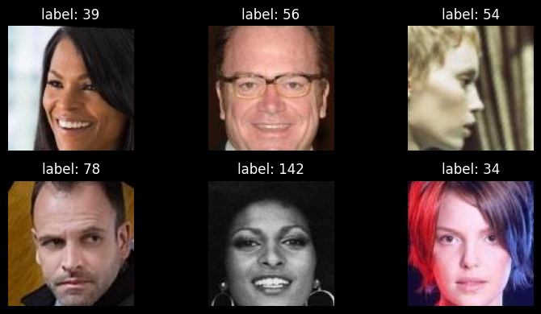
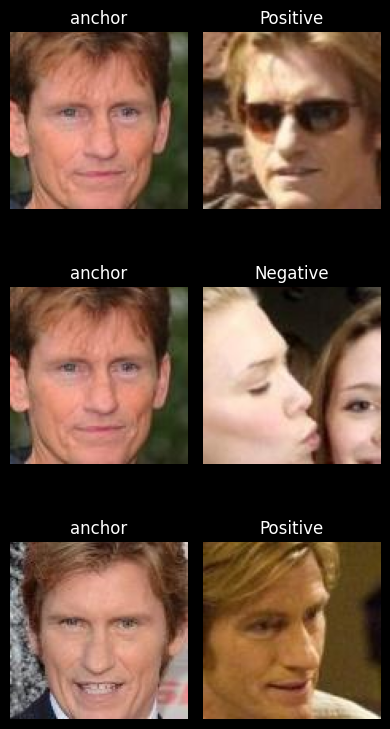
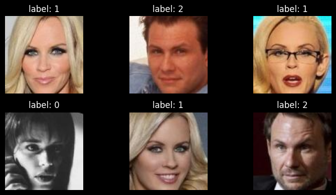
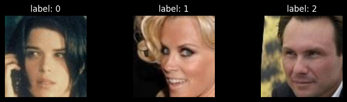
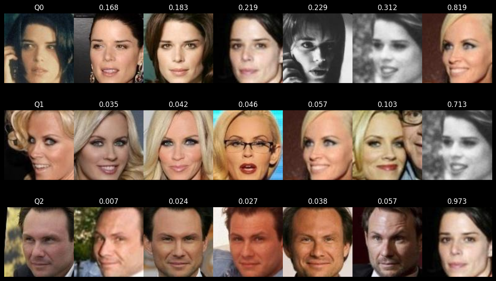
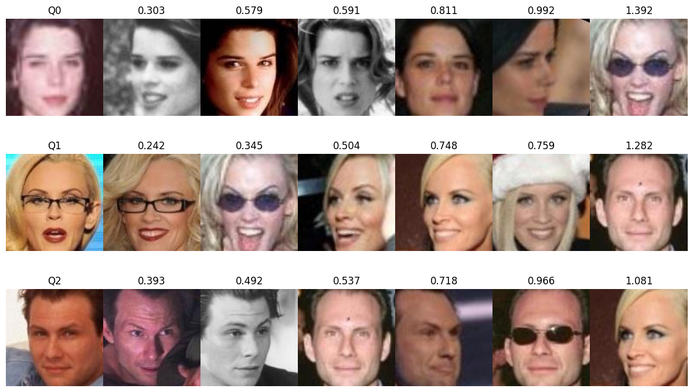

# Few-Shot Face Recognition with Siamese Networks

[](https://www.tensorflow.org/)
[](LICENSE)

This repository implements two **Few-Shot Learning (FSL)** approaches for face recognition using Siamese networks:

- **Contrastive Loss** – [`fsl-contrastive-score.ipynb`](fsl-contrastive-score.ipynb)  
- **Triplet Loss** – [`fsl-triplet-score.ipynb`](fsl-triplet-score.ipynb)

Both models are trained on the **CASIA-WebFace** dataset and evaluated on **unseen identities** using a structured **support-query protocol**, simulating real-world few-shot recognition scenarios.

---

## 🧠 Overview

Few-shot face recognition aims to identify a person using only a small number of reference images.

Instead of training a traditional classifier, we learn an **embedding space** where:

- Images of the **same identity** are close together  
- Images of **different identities** are far apart  

Two Siamese architectures are implemented:

| Approach     | Loss Function | Training Strategy | Evaluation Protocol |
|-------------|--------------|------------------|--------------------|
| Contrastive | `(1-Y)*d² + Y*max(0, m-d)²` | Positive & negative pairs | Support set (5 images/class) + Query (1 image/class) |
| Triplet     | `max(0, d(a,p) - d(a,n) + margin)` | Anchor–Positive–Negative triplets | Same support/query setup |

Both approaches use a pretrained **FaceNet (keras-facenet)** backbone with additional trainable dense layers.

---

## 🔬 Dataset: CASIA-WebFace

We use a subset of the **CASIA-WebFace** dataset.

During training:

- Three identity folders (`000009`, `000032`, `000046`) are **completely excluded**
- The model never sees these identities during training

During evaluation:

- Each held-out identity provides:
  - **Support set:** 5 images
  - **Query set:** 1 image

This ensures a clean few-shot evaluation setting.



---

# 📊 Contrastive Learning Notebook

## 1️⃣ Data Preparation

Training data is generated as:

- **Positive pairs:** two images from the same identity  
- **Negative pairs:** two images from different identities  



Data pipeline:

- `tf.data.Dataset`
- Resize to **160×160**
- Pixel normalization
- On-the-fly preprocessing

---

## 2️⃣ Model Architecture

- **Backbone:** FaceNet (pretrained on VGGFace2)
- Backbone initially frozen
- Added layers:
  - Dense (64)
  - Dense (32)
  - Dropout
  - L2 normalization
- Distance metric: **Euclidean distance**

### Contrastive Loss (margin = 1.0)

```python
def contrastive_loss(y_true, y_pred):
    margin = 1.0
    square_pred = K.square(y_pred)
    margin_square = K.square(K.maximum(margin - y_pred, 0))
    return K.mean((1 - y_true) * square_pred + y_true * margin_square)
```

Interpretation:

- Similar pairs → distance minimized  
- Dissimilar pairs → distance pushed beyond margin  

---

## 3️⃣ Training Configuration

- Optimizer: RMSprop  
- Batch size: 32  
- Epochs: 5  

---

## 4️⃣ Inference: Support–Query Protocol

For each unseen identity:

- 5 support images are embedded
- 1 query image is embedded
- The query embedding is compared against all support embeddings
- The identity corresponding to the **minimum Euclidean distance** is selected

### Support Set Example


### Query Set Example


---

# 📈 Triplet Learning Notebook

Structure is similar to the contrastive approach.

## Triplet Construction

Each training sample consists of:

- **Anchor**
- **Positive (same class)**
- **Negative (different class)**

### Triplet Loss (margin = 0.2)

\[
L = max(0, d(a,p) - d(a,n) + margin)
\]

Training configuration and inference protocol are identical to the contrastive setup.

---

# 🔍 Final Inference Results

Both models are evaluated using the support-query setup.

For each query:

1. Compute embedding  
2. Measure distance to each support image  
3. Rank support images by ascending distance  

The correct identity consistently appears with the **lowest distances**.

| Model       | Example Result |
|------------|---------------|
| Contrastive |  |
| Triplet     |  |

---

# ⚠️ Understanding Query–Support Distance Visualization

In the visualization:

- The **first image** is the query image  
- The **next 5 images** belong to the correct support class  
- The **last image** is from a different identity  

Observations:

- Correct support images have **very small distances**
- Unrelated images have **significantly larger distances**
- Results are sorted in ascending order of distance

This demonstrates that the embedding space is well structured and discriminative.

---

# 🚀 How to Run

1. Clone the repository:

```bash
git clone https://github.com/EmadAmanifar/FSL-face-recursion.git
```

2. Install dependencies:

```bash
pip install tensorflow keras-facenet mtcnn numpy matplotlib opencv-python Pillow
```

3. Download **CASIA-WebFace** (or any aligned face dataset).
4. Place the dataset in a directory (e.g., `casia_dataset/`).
5. Open the desired notebook in:
   - Jupyter
   - Kaggle
   - Google Colab
6. Modify the `base_dir` path.
7. Run all cells.

**Note:** The notebooks were originally developed on Kaggle. You may need to adjust dataset paths if running locally.

---

# 📌 Results & Observations

- Validation accuracy: **~82–83% after 5 epochs**
- Contrastive slightly outperforms triplet in this setup
- Embedding space shows clear identity clustering
- Support–query evaluation confirms correct nearest-neighbor retrieval

---

# 🛠 Requirements

- Python 3.7+
- TensorFlow 2.x
- keras-facenet
- mtcnn
- numpy
- matplotlib
- opencv-python
- Pillow
